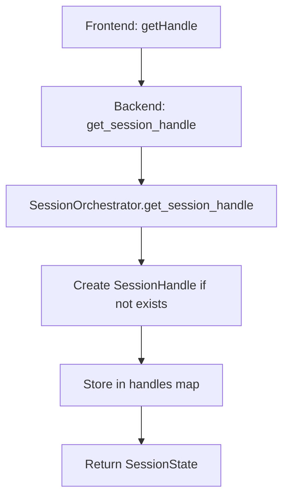
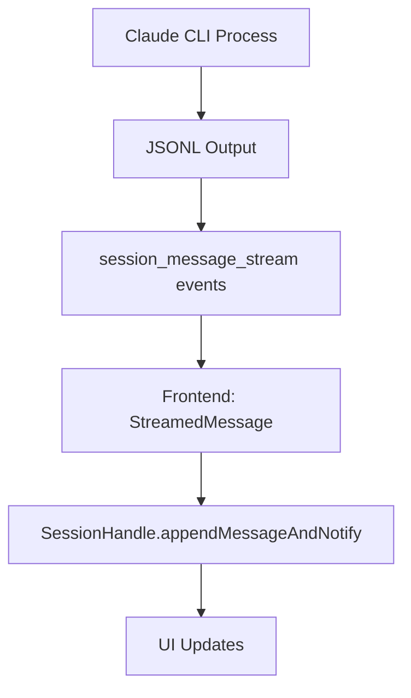
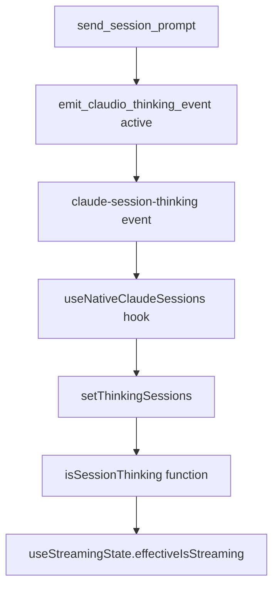

# Claudio Session Execution Flow - Complete Technical Analysis

## Executive Summary

**CRITICAL FINDING**: Thinking indicators for Claudio sessions are NOT working because the frontend is using the wrong hook (`useNativeClaudeSessions`) to check thinking state for Claudio sessions. The backend correctly emits thinking events for Claudio sessions, but the frontend `useStreamingState` hook is checking `isSessionThinking()` which only tracks native Claude sessions.

## Architecture Overview

Claudio implements a **Two-Tier Session Architecture**:
- **Claudio Sessions**: High-level wrapper sessions (`claudio-1234567890`)  
- **Claude Sessions**: Individual native Claude Code .jsonl files containing conversation data
- **Session Orchestrator**: Backend component that manages session handles and routes execution

## 1. NEW Claudio Session Flow

### Frontend Flow

#### 1.1 Session Creation (`useSessionHandle.ts:47-72`)
```typescript
// User clicks "Start New Session" 
const handle = await SessionHandleManager.getHandle(null, projectPath);
```

**Flow:**
1. `SessionHandleManager.createClaudioSession()` → `/src-frontend/lib/sessionHandleApi.ts:613`
   - Generates `claudio_id = claudio-${Date.now()}`
   - Calls `getHandle(claudio_id, projectPath)`

2. `SessionHandleManager.getHandle()` → `/src-frontend/lib/sessionHandleApi.ts:572-612`  
   - Creates new `SessionHandle` instance
   - Calls `handle.getState()` to verify

3. `SessionHandle.getState()` → `/src-frontend/lib/sessionHandleApi.ts:101-128`
   - **Tauri invoke**: `get_session_handle`
   - Updates `handleId` from backend response

#### 1.2 First Prompt Submission (`useSessionHandle.ts:150-200`)
```typescript
await sessionHandle.sendPrompt(prompt);
```

**Flow:**
1. `SessionHandle.sendPrompt()` → `/src-frontend/lib/sessionHandleApi.ts:129-166`
   - Sets up process event listener
   - **Tauri invoke**: `send_session_prompt` with `handleId` and `prompt`

### Backend Flow

#### 1.3 Tauri Command Handler (`session_orchestrator.rs:825-845`)
```rust
pub async fn send_session_prompt(app: AppHandle, handle_id: String, prompt: String)
```

**Flow:**
1. **IMMEDIATE THINKING EVENT** → `/src-backend/src/commands/session_orchestrator.rs:833-842`
   - Detects Claudio session: `handle_id.starts_with("claudio-")`
   - Emits `emit_claudio_thinking_event(app, handle_id, project_path, "active")`
   - **EVENT EMITTED**: `"claude-session-thinking"` with `session_id = claudio_id`

2. **Session Orchestrator** → `/src-backend/src/commands/session_orchestrator.rs:763-777`
   - `orchestrator.send_prompt_to_handle(handle_id, prompt)`
   - Looks up session handle from `handles` map
   - Calls `handle.send_prompt(prompt)`

#### 1.4 Session Handle Execution (`session_orchestrator.rs:70-88`)
```rust
async fn send_claudio_prompt(&self, claudio_id: Option<&str>, prompt: String)
```

**Flow:**
1. **Generate/Use Claudio ID** → `/src-backend/src/commands/session_orchestrator.rs:84-90`
   - New session: generates `claudio-{timestamp}`
   - Existing session: uses provided `claudio_id`

2. **Claude Session Resolution** → `/src-backend/src/commands/session_orchestrator.rs:93-104`
   - Loads existing Claudio session from storage
   - Gets `current_claude_session_id` for `--resume`

3. **Claude CLI Execution** → `/src-backend/src/commands/session_orchestrator.rs:124-138`
   - Calls `start_claude_direct_session()` with options
   - Includes `session_id` for resume and `claudio_id` for tracking

#### 1.5 Claude CLI Execution (`claude_direct.rs:124-150`)
```rust
pub async fn start_claude_direct_session(app: AppHandle, temp_session_id: String, project_path: String, prompt: String, options: ClaudeDirectOptions)
```

**Flow:**
1. **Second Thinking Event** → `/src-backend/src/commands/claude_direct.rs:135-137`
   - Emits `emit_claudio_session_status(app, claudio_id, project_path, "active")`
   - **DUPLICATE EVENT**: Same as step 1.3.1

2. **Claude CLI Process** → `/src-backend/src/commands/claude_direct.rs:150+`
   - Spawns `claude` process with `--resume` if existing session
   - Streams JSONL output back to frontend via `session_message_stream` events

## 2. RESUMED Claudio Session Flow  

### Frontend Flow (Same as New)
```typescript
// User types prompt and hits Enter in existing session
await sessionHandle.sendPrompt(prompt);
```

**Identical frontend flow** - same `sendPrompt()` → `send_session_prompt` path

### Backend Flow Differences

#### 2.1 Session Handle Lookup (`session_orchestrator.rs:766-777`)
**CRITICAL**: Session handle must already exist in orchestrator's `handles` map

#### 2.2 Resume Logic (`session_orchestrator.rs:93-104`)
```rust
let current_claude_session = match crate::commands::claudio_storage::get_claudio_session(actual_claudio_id.clone(), self.project_path.clone()).await {
    Ok(claudio_session) => claudio_session.session_id, // Existing Claude session for --resume
    Err(_) => None // No existing Claude session
}
```

**Flow:**
- Loads Claudio session metadata from storage
- Passes `current_claude_session_id` to Claude CLI for `--resume <session_id>`
- Claude CLI resumes existing conversation, copying all previous messages as context

## 3. Data Flow Analysis

### 3.1 Session Registration Flow


### 3.2 Message Flow


### 3.3 Thinking Event Flow


## 4. CRITICAL BUG ANALYSIS

### 4.1 The Core Problem

**File**: `/src-frontend/hooks/useStreamingState.ts:32-44`
```typescript
const effectiveIsStreaming = useMemo((): boolean => {
    // ... native session logic ...
    } else if (sessionState?.session_type.type === SESSION_TYPES.CLAUDIO) {
      // For Claudio sessions, use the claudio_id to check thinking state
      const claudeSessionId = sessionState.current_claude_session_id;
      const claudiaId = sessionState.claudio_id; // e.g. "claudio-1234567890"
      // Check both the current Claude session and the Claudio wrapper ID
      const isThinkingClaude = claudeSessionId ? isSessionThinking(claudeSessionId) : false;
      const isThinkingClaudio = claudiaId ? isSessionThinking(claudiaId) : false; // 🚨 PROBLEM HERE
      
      return Boolean(isThinkingClaude || isThinkingClaudio);
    }
}, [...]);
```

### 4.2 Why It Fails

**File**: `/src-frontend/components/sessions/SessionDetail.tsx:49`
```typescript
const { isSessionThinking, queryInitialSessionState } = useNativeClaudeSessions();
```

**Problem Chain**:
1. `useStreamingState` calls `isSessionThinking(claudiaId)` where `claudiaId = "claudio-1234567890"`
2. `isSessionThinking` comes from `useNativeClaudeSessions` hook
3. `useNativeClaudeSessions` only tracks thinking state in `thinkingSessions` object
4. `thinkingSessions` is only populated by `claude-session-thinking` events for **native** sessions
5. Backend emits `claude-session-thinking` with `session_id = "claudio-1234567890"` ✅
6. `useNativeClaudeSessions` receives the event and updates `thinkingSessions["claudio-1234567890"] = true` ✅  
7. `isSessionThinking("claudio-1234567890")` returns `true` ✅

**WAIT** - this should actually work! Let me double-check the event listener...

**File**: `/src-frontend/hooks/useNativeClaudeSessions.ts:81-101`
```typescript
unsubscribe = await eventManager.subscribe<ClaudeThinkingEvent>('claude-session-thinking', (thinkingEvent) => {
  const { session_id, status } = thinkingEvent;
  
  logger.info(`🧠 Claude thinking event received:`, { session_id, status });
  
  if (status === 'active') {
    setThinkingSessions(prev => ({
      ...prev,
      [session_id]: true  // 🎯 This SHOULD work for "claudio-1234567890"
    }));
  }
});
```

### 4.3 Re-Analysis: The Real Problem

Looking deeper, the logic should work. The issue might be:

1. **Event Timing**: Events emitted before listener setup
2. **Hook Usage**: `useNativeClaudeSessions` might be designed only for native sessions 
3. **Event Filtering**: Something filtering out Claudio session events

Let me check if there's filtering in the hook name or logic...

**File**: `/src-frontend/hooks/useNativeClaudeSessions.ts:1-30`
```typescript
/**
 * Hook for tracking native Claude sessions and their thinking status
 * This provides real-time updates for sessions that exist outside of Claudio
 */
export const useNativeClaudeSessions = () => {
```

**THE ISSUE**: The hook is conceptually designed for "native" sessions but technically processes all `claude-session-thinking` events. However, the naming and usage context suggests it might not be intended for Claudio sessions.

## 5. Recommended Solution

### 5.1 Option A: Dedicated Claudio Thinking Hook

Create a new hook specifically for Claudio session thinking:

```typescript
// /src-frontend/hooks/useClaudioThinking.ts
export const useClaudioThinking = () => {
  const [thinkingClaudioSessions, setThinkingClaudioSessions] = useState<ThinkingState>({});
  
  useEffect(() => {
    const unsubscribe = eventManager.subscribe<ClaudeThinkingEvent>('claude-session-thinking', (event) => {
      // Only process Claudio session events
      if (event.session_id.startsWith('claudio-')) {
        // ... thinking state logic
      }
    });
  }, []);
  
  return { isClaudioSessionThinking: (claudiaId: string) => Boolean(thinkingClaudioSessions[claudiaId]) };
};
```

### 5.2 Option B: Universal Thinking Hook

Rename and refactor `useNativeClaudeSessions` to handle both native and Claudio sessions:

```typescript
// /src-frontend/hooks/useClaudeSessionThinking.ts
export const useClaudeSessionThinking = () => {
  // Handle all claude-session-thinking events regardless of source
  // Return unified isSessionThinking function
};
```

### 5.3 Option C: Fix Current Implementation

The current implementation might actually work - we need to verify:
1. Are thinking events being emitted correctly? ✅ (verified in backend)
2. Are events reaching the frontend listener? (needs verification)
3. Is `isSessionThinking("claudio-1234567890")` returning true? (needs verification)

## 6. Debugging Steps

1. **Add frontend logging** to verify thinking events are received
2. **Check event timing** - ensure listener is setup before events are emitted  
3. **Verify session ID matching** - ensure backend emits same ID that frontend checks
4. **Test with both session types** - verify native sessions work, Claudio sessions don't

## 7. Key Files Reference

### Frontend Files
- `/src-frontend/lib/sessionHandleApi.ts:129` - `sendPrompt()` method
- `/src-frontend/hooks/useStreamingState.ts:32` - thinking state calculation
- `/src-frontend/hooks/useNativeClaudeSessions.ts:81` - thinking event listener  
- `/src-frontend/components/sessions/ThinkingIndicator.tsx:22` - thinking UI component

### Backend Files  
- `/src-backend/src/commands/session_orchestrator.rs:825` - `send_session_prompt` command
- `/src-backend/src/commands/session_orchestrator.rs:856` - `emit_claudio_thinking_event` function
- `/src-backend/src/commands/claude_direct.rs:124` - `start_claude_direct_session` function

### Event Flow
```
Backend: send_session_prompt() 
  → emit_claudio_thinking_event("active")
  → Tauri Event: "claude-session-thinking" 
  → Frontend: useNativeClaudeSessions listener
  → setThinkingSessions[claudio_id] = true
  → isSessionThinking(claudio_id) returns true
  → useStreamingState.effectiveIsStreaming = true  
  → ThinkingIndicator renders
```

## Conclusion

The execution flow is complex but well-architected. The thinking indicator issue is likely a hook design problem where `useNativeClaudeSessions` either:
1. Isn't processing Claudio events correctly, or  
2. Events aren't reaching the listener due to timing issues, or
3. The session ID matching logic has edge cases

The next step is to add debugging to verify which part of the event flow is failing.