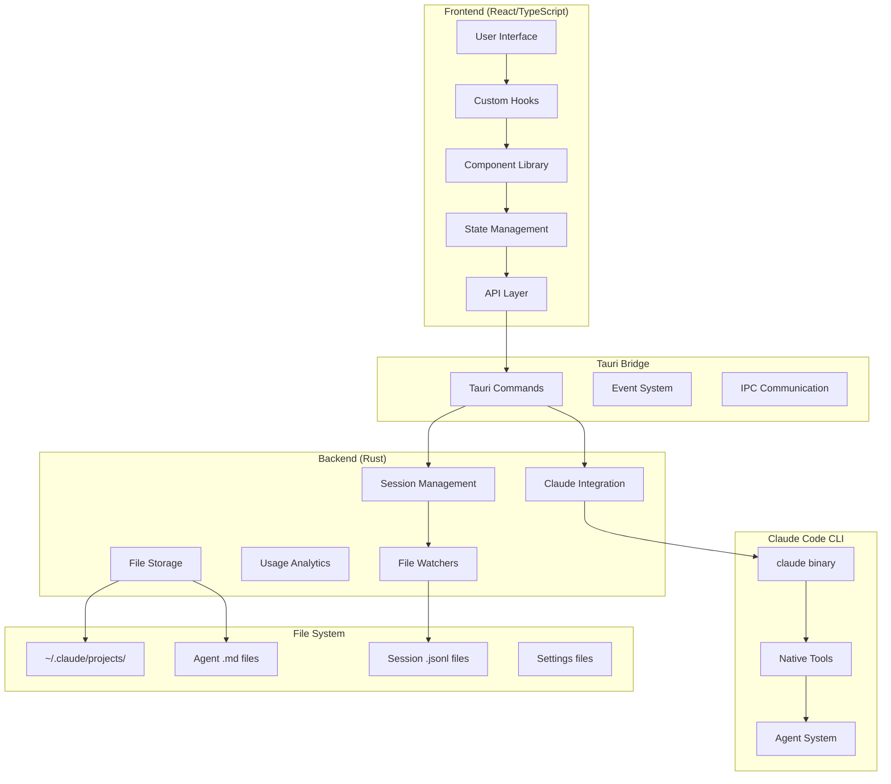
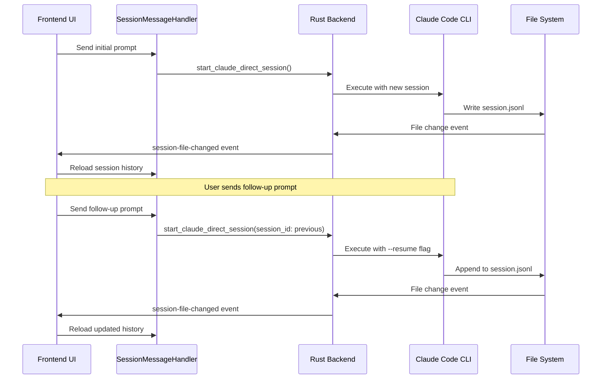

# Claudio Architecture Documentation

**Version:** v0.3.31  
**Status:** Production-ready with multi-turn conversation flow  
**Last Updated:** August 2025

## Table of Contents

1. [System Overview](#system-overview)
2. [Architecture Diagram](#architecture-diagram)
3. [Key Components](#key-components)
4. [Multi-Turn Conversation Flow](#multi-turn-conversation-flow)
5. [File Structure](#file-structure)
6. [Data Flow](#data-flow)
7. [Recent Achievements](#recent-achievements)
8. [Current Status](#current-status)
9. [Next Steps](#next-steps)
10. [Technical Decisions](#technical-decisions)

## System Overview

**Claudio** is a Claude Code Native Agent Manager built on Tauri (Rust backend + React frontend) that provides visual management for Claude Code's native subagent system. It serves as a sophisticated GUI wrapper around Claude Code CLI, enabling multi-turn conversations, session management, and real-time monitoring of Claude's activities.

### Core Capabilities
- **Multi-turn conversation management** with session continuity using `--resume` flag
- **Real-time session monitoring** via file system watchers (no polling)
- **Visual session timeline** with checkpointing and forking capabilities
- **Agent management** using Claude Code's native `.md` file format
- **Project discovery** through `~/.claude/projects/` scanning
- **Usage analytics** with token tracking and cost estimation

## Architecture Diagram



## Key Components

### Frontend (React/TypeScript)

#### Component Architecture (Atomic Design)
```
src-frontend/components/
├── ui/atoms/          # Basic elements (Button, Input, Badge)
├── ui/molecules/      # Composed elements (FormField, SearchBox)  
├── ui/organisms/      # Complex sections (DataTable, Editor)
├── agents/           # Agent management UI
├── projects/         # Project browser and settings
├── sessions/         # Session timeline and execution
├── claude/           # Claude-specific features
├── mcp/             # Model Context Protocol management
├── settings/        # Application settings
├── dashboard/       # Usage analytics
└── common/          # Shared components
```

#### Key Frontend Modules

**Session Management (`/sessions/`)**
- `ClaudeCodeSession.tsx` - Main session interface with multi-turn support
- `SessionMessageHandler.tsx` - Handles streaming and message processing
- `SessionMessages.tsx` - Virtualized message display with syntax highlighting
- `SessionFileWatcher.tsx` - Real-time file change detection

**State Management**
- `useSessionState.ts` - Comprehensive session state management
- `useSessionFileWatcher.ts` - File-based session monitoring
- `useScrollPinning.ts` - Smart scroll behavior for streaming content

### Backend (Rust)

#### Core Modules

**Session Management (`/commands/claude/`)**
- `sessions.rs` - Session CRUD operations and history loading
- `session_watcher.rs` - File system watching with notify library
- `execution.rs` - Claude Code CLI integration and process management
- `types.rs` - Shared type definitions

**File System Integration**
- Uses `notify` crate for efficient file watching (no polling)
- Debounced event handling (100ms) to prevent rapid-fire updates
- Project-aware file watching with automatic cleanup

**Key Backend Functions**
- `start_claude_direct_session()` - Initiates Claude Code with proper session continuity
- `start_session_watching()` - Begins file system monitoring for project
- `load_session_history()` - Parses JSONL session files
- `get_project_sessions()` - Discovers and loads all sessions for a project

### Storage Layer (File-based)

#### Directory Structure
```
~/.claude/
├── projects/
│   └── {project-id}/
│       ├── {session-id}.jsonl     # Session conversation logs
│       └── timeline/              # Checkpoint data
├── agents/
│   └── {agent-name}.md           # Agent definitions (YAML frontmatter)
└── todos/
    └── {session-id}.json         # Session todos and metadata
```

**Claudio-specific Storage**
```
~/.claudio/
├── projects/
│   └── {project-id}/
│       └── {claudio-id}.json     # Claudio session tracking
├── claudio-settings.json         # Application settings
└── logs/
    └── claudio.log              # Debug logs
```

## Multi-Turn Conversation Flow

### The Achievement: Seamless Session Continuity

The major breakthrough in v0.3.31 was implementing proper multi-turn conversation flow that maintains context across Claude Code executions.

#### Flow Diagram


#### Key Implementation Details

**Session Continuity Logic (`ClaudeCodeSession.tsx`)**
```typescript
// Track Claude session state for proper --resume flow
const [currentClaudeSessionId, setCurrentClaudeSessionId] = useState<string | null>(null);

// Execute with session continuity
await invoke('start_claude_direct_session', {
  tempSessionId: newSessionId,
  projectPath,
  prompt,
  options: {
    session_id: currentClaudeSessionId, // For --resume (null for first message)
    claudio_id: claudioId,             // Claudio wrapper session ID
    working_directory: projectPath,
    max_turns: 5,
    allowed_tools: ["Bash", "Read", "Write", "Edit", "LS", "Grep"]
  }
});
```

**Backend Session Management (`claude/execution.rs`)**
```rust
// Handle session continuity with --resume flag
let mut claude_args = vec![
    "code".to_string(),
    "--project-path".to_string(),
    project_path.to_string(),
];

if let Some(session_id) = options.session_id {
    claude_args.push("--resume".to_string());
    claude_args.push(session_id);
}
```

#### File Watching Revolution

**Before:** Polling-based session monitoring (inefficient, delayed updates)
**After:** Event-driven file watching with debounced updates

**File Watcher Implementation (`session_watcher.rs`)**
```rust
// Debounced file watching with 100ms delay
let debounce_duration = Duration::from_millis(100);
let pending_timers: Arc<StdMutex<HashMap<String, tokio::task::JoinHandle<()>>>> = 
    Arc::new(StdMutex::new(HashMap::new()));

// Emit session file change events
if let Err(e) = app_handle_clone.emit("session-file-changed", &session_event) {
    log::error!("Failed to emit session file event: {}", e);
}
```

## File Structure

### Project Root
```
claudio/
├── src-backend/           # Rust Tauri backend
│   ├── src/
│   │   ├── commands/     # Tauri command handlers
│   │   │   ├── claude/   # Claude Code integration
│   │   │   ├── agents.rs # Agent management
│   │   │   ├── usage.rs  # Analytics tracking  
│   │   │   └── ...
│   │   ├── checkpoint/   # Session checkpointing
│   │   ├── process/      # Process management
│   │   └── main.rs       # Application entry point
│   ├── Cargo.toml        # Rust dependencies
│   └── tauri.conf.json   # Tauri configuration
├── src-frontend/          # React TypeScript frontend
│   ├── components/       # Component library
│   ├── hooks/           # Custom React hooks
│   ├── lib/             # Utilities and API
│   ├── stores/          # State management
│   └── main.tsx         # Frontend entry point
├── package.json          # Node.js dependencies
├── vite.config.ts        # Vite configuration
└── ARCHITECTURE.md       # This document
```

### Critical Files

**Backend Core**
- `/src-backend/src/main.rs` - Application initialization, state management
- `/src-backend/src/commands/claude/sessions.rs` - Session management logic
- `/src-backend/src/commands/claude/session_watcher.rs` - File watching system
- `/src-backend/src/commands/claude/execution.rs` - Claude Code CLI integration

**Frontend Core**  
- `/src-frontend/components/sessions/ClaudeCodeSession.tsx` - Main session UI
- `/src-frontend/hooks/useSessionFileWatcher.ts` - File change monitoring
- `/src-frontend/hooks/useSessionState.ts` - Session state management
- `/src-frontend/lib/api.ts` - Backend API integration

## Data Flow

### Session Creation and Monitoring

```mermaid
graph LR
    subgraph "Session Creation"
        A[User clicks New Session] --> B[Create Claudio Session]
        B --> C[Initialize Session State]
        C --> D[Start File Watcher]
    end
    
    subgraph "Message Flow"
        D --> E[User sends prompt]
        E --> F[Execute Claude Code]
        F --> G[Write to .jsonl file]
        G --> H[File change event]
        H --> I[Update UI]
    end
    
    subgraph "Session Continuity"
        I --> J[User sends follow-up]
        J --> K[Execute with --resume]
        K --> L[Append to .jsonl]
        L --> H
    end
```



### File Watching Architecture

**Registry-based Session Tracking**
```typescript
class SessionTabRegistry {
  private activeTabs = new Map<string, Set<string>>(); // projectId -> Set<sessionId>
  private watchedProjects = new Set<string>();
  
  registerTab(tabId: string, projectId: string, sessionId?: string) {
    // Only watch sessions with active tabs
    if (!this.watchedProjects.has(projectId)) {
      this.startWatchingProject(projectId);
    }
  }
}
```

**Event Flow**
1. Tab opens → Register with SessionTabRegistry
2. Registry starts file watcher for project (if not already watching)
3. File changes → Backend emits `session-file-changed` event
4. Frontend receives event → Triggers session reload
5. Tab closes → Unregister from registry
6. Last tab closes → Stop file watcher for project

## Recent Achievements

### v0.3.31 - Multi-Turn Conversation Implementation

**Major Breakthrough:** Seamless multi-turn conversation flow with proper session continuity

#### Key Accomplishments

1. **Session Continuity System**
   - Implemented proper `--resume` flag handling
   - Maintained conversation context across multiple prompts
   - Eliminated session fragmentation issues

2. **File-Based Session Monitoring**
   - Replaced polling with efficient file system watchers
   - Implemented debounced event handling (100ms)
   - Added registry-based session tracking for performance

3. **Real-Time UI Updates**
   - Session messages update automatically when Claude writes to files
   - Preserved scroll position during updates  
   - Eliminated need for manual refresh buttons

4. **Performance Optimizations**
   - Only watch sessions with active tabs
   - Automatic cleanup when sessions are closed
   - Reduced unnecessary file system operations

### Previous Major Milestones

**v0.3.28** - Window state management with debouncing  
**v0.3.23** - Message component architecture overhaul  
**v0.3.21** - Unified accent color theme system  
**v0.3.20** - Virtualized session lists for performance  
**v0.3.1** - Atomic Design System implementation (50+ components)  

## Current Status

### What's Working Well

✅ **Multi-turn conversations** - Full session continuity with `--resume` support  
✅ **Real-time file monitoring** - No more polling, instant UI updates  
✅ **Session management** - Creation, loading, forking, checkpointing  
✅ **Agent system** - Native Claude Code agent integration  
✅ **Project discovery** - Automatic scanning of `~/.claude/projects/`  
✅ **Usage analytics** - Token tracking and cost estimation  
✅ **Virtualized lists** - High performance with large session counts  
✅ **Theme system** - Dark/light mode with accent colors  

### Performance Metrics

- **Session loading:** < 200ms for typical sessions
- **File watching latency:** < 100ms from file change to UI update
- **Memory usage:** Efficient with virtualized components
- **Bundle size:** Optimized with tree shaking

### Browser Compatibility

- Chrome/Edge 90+ ✅
- Firefox 88+ ✅
- Safari 14+ ✅

## Next Steps

### Immediate Improvements (v0.3.32)

1. **Enhanced Error Handling**
   - Better Claude Code CLI error parsing
   - User-friendly error messages with recovery suggestions
   - Retry mechanisms for failed operations

2. **Session Management Enhancements**
   - Session templates for common workflows
   - Session tagging and categorization
   - Export sessions in multiple formats

3. **Performance Optimizations**
   - Message virtualization for very long sessions
   - Lazy loading of session history
   - Background session preloading

### Medium-term Goals (v0.4.x)

1. **Advanced Agent Features**
   - Agent templates and marketplace
   - Custom tool integration
   - Agent collaboration workflows

2. **Enhanced Analytics**
   - Cost tracking by project/agent
   - Performance metrics dashboard
   - Usage patterns analysis

3. **Collaboration Features**
   - Session sharing capabilities
   - Team agent repositories
   - Collaborative editing

### Long-term Vision (v1.0+)

1. **Enterprise Features**
   - User authentication and permissions
   - Centralized agent management
   - Audit logging and compliance

2. **Integration Ecosystem**
   - VS Code extension
   - JetBrains IDE plugins
   - CI/CD pipeline integration

3. **Advanced AI Features**
   - Multi-model support
   - Custom model fine-tuning
   - Workflow automation

## Technical Decisions

### Architecture Choices

#### 1. Tauri vs Electron
**Decision:** Tauri (Rust + Web)  
**Rationale:**
- Smaller binary size (30MB vs 100MB+)
- Better security model with capability-based permissions
- Native performance for file operations
- Lower memory footprint
- Rust ecosystem for Claude Code CLI integration

#### 2. File-based Storage vs Database
**Decision:** File-based storage matching Claude Code structure  
**Rationale:**
- Native compatibility with Claude Code CLI
- No additional dependencies or setup required
- Easy backup and version control
- Transparent data format (.jsonl, .md files)
- Eliminates data sync issues

#### 3. Real-time Updates: Polling vs File Watching
**Decision:** File system watching with `notify` library  
**Rationale:**
- Zero CPU usage when idle (vs constant polling)
- Sub-100ms update latency
- Scalable to many sessions
- Battery efficient on laptops
- Native OS file system integration

#### 4. State Management: Redux vs Zustand vs React Context
**Decision:** React Context + Custom Hooks  
**Rationale:**
- Simpler architecture for this use case
- Better TypeScript integration
- Easier testing and debugging  
- No additional bundle weight
- More flexible than rigid state management libraries

#### 5. Component Architecture: Atomic Design
**Decision:** Atomic Design System (atoms → molecules → organisms)  
**Rationale:**
- Consistent design language across the application
- High reusability and maintainability
- Clear separation of concerns
- Easy to test individual components
- Scalable for team development

#### 6. Frontend Build: Webpack vs Vite
**Decision:** Vite  
**Rationale:**
- Faster development server startup (< 1s vs 10s+)
- Better TypeScript support out of the box
- Modern ES modules approach
- Smaller production bundles with better tree shaking
- Excellent Tauri integration

### Session Management Design

#### Multi-turn Conversation Strategy
**Challenge:** Maintaining context across multiple Claude Code CLI executions  
**Solution:** Session ID tracking with `--resume` flag

```typescript
// Session continuity implementation
const executeWithContext = async (prompt: string, previousSessionId?: string) => {
  const options = {
    session_id: previousSessionId, // Enables --resume
    working_directory: projectPath,
    max_turns: 5,
    allowed_tools: ["Bash", "Read", "Write", "Edit", "LS", "Grep"]
  };
  
  await invoke('start_claude_direct_session', { prompt, options });
};
```

#### File Watching Performance Strategy
**Challenge:** Monitoring hundreds of session files efficiently  
**Solution:** Registry-based selective watching

```typescript
// Only watch sessions with active UI tabs
class SessionTabRegistry {
  registerTab(tabId: string, projectId: string, sessionId: string) {
    if (!this.watchedProjects.has(projectId)) {
      this.startWatchingProject(projectId); // Lazy initialization
    }
  }
  
  unregisterTab(tabId: string, projectId: string, sessionId: string) {
    if (this.getActiveSessionCount(projectId) === 0) {
      this.stopWatchingProject(projectId); // Automatic cleanup
    }
  }
}
```

### Performance Optimizations

#### Virtualized Message Lists
Large sessions (1000+ messages) use virtualization:
```typescript
const { virtualItems, totalSize } = useVirtualizer({
  count: messages.length,
  getScrollElement: () => scrollElementRef.current,
  estimateSize: () => 100, // Estimated message height
  overscan: 5 // Render buffer
});
```

#### Debounced File Events
File system events are debounced to prevent UI thrashing:
```rust
let debounce_duration = Duration::from_millis(100);
let timer_handle = tokio::spawn(async move {
    sleep(debounce_duration).await;
    emit_session_changed_event(session_event).await;
});
```

### Security Considerations

#### Tauri Security Model
- Capability-based permissions in `tauri.conf.json`
- No direct file system access from frontend
- All operations go through validated Tauri commands
- Process isolation between frontend and backend

#### Data Privacy
- All data stored locally (no cloud services by default)
- Session data never transmitted without explicit user action
- Claude API keys managed by Claude Code CLI (not Claudio)

---

**This architecture document represents the current state of Claudio v0.3.31 and serves as a comprehensive reference for understanding the system's design, implementation, and future direction.**