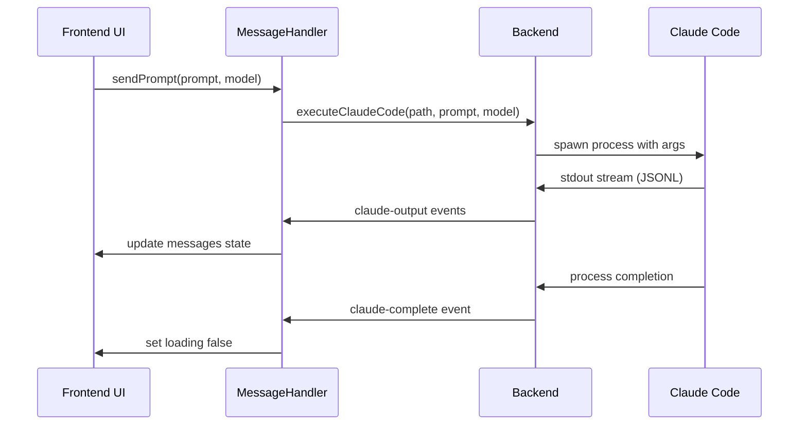
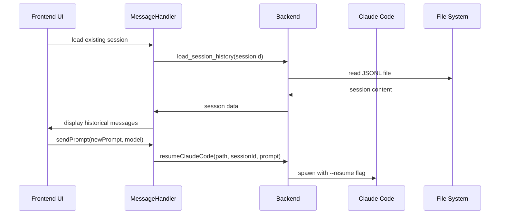
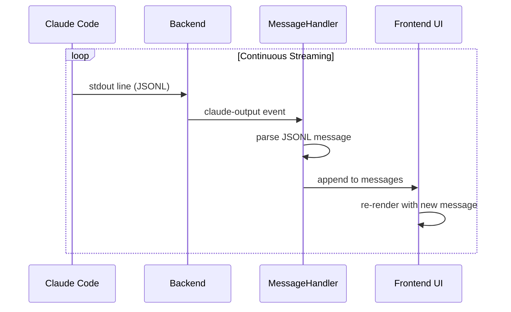

# Claudio Claude Code Integration Architecture

## Overview

Claudio is a **Claude Code Native Agent Manager** that provides visual management for Claude Code's native subagent system. This document details how Claudio integrates with Claude Code to enable session streaming, instruction sending, and real-time interaction management.

## Table of Contents

1. [Architecture Overview](#architecture-overview)
2. [Session Streaming Implementation](#session-streaming-implementation)
3. [Instruction Sending Mechanisms](#instruction-sending-mechanisms)
4. [Key Integration Points](#key-integration-points)
5. [Data Flow](#data-flow)
6. [Component Reference](#component-reference)
7. [API Reference](#api-reference)

## Architecture Overview

```
┌─────────────────────────────────────────┐
│           Frontend (React/TS)           │
├─────────────────────────────────────────┤
│ • SessionMessageHandler (streaming)     │
│ • ClaudeCodeSession (UI management)     │
│ • Real-time event listeners             │
│ • Session file watching                 │
└─────────────────────────────────────────┘
                    │
              Tauri Bridge
                    │
┌─────────────────────────────────────────┐
│           Backend (Rust)                │
├─────────────────────────────────────────┤
│ • Claude process execution              │
│ • Real-time stdout/stderr streaming     │
│ • Session file monitoring               │
│ • Process lifecycle management          │
└─────────────────────────────────────────┘
                    │
┌─────────────────────────────────────────┐
│         Claude Code Process            │
├─────────────────────────────────────────┤
│ • JSONL output streaming                │
│ • File-based session storage            │
│ • Tool execution and responses          │
│ • Session state persistence             │
└─────────────────────────────────────────┘
```

## Session Streaming Implementation

### Backend Session Management

Located in `src-backend/src/commands/claude/`, the backend provides several key components:

#### 1. Session Execution (`execution.rs`)

**Core Commands:**
- `execute_claude_code()` - Starts new Claude Code sessions
- `continue_claude_code()` - Continues existing conversations  
- `resume_claude_code()` - Resumes sessions by ID
- `cancel_claude_execution()` - Cancels running sessions

**Process Management:**
```rust
// src-backend/src/commands/claude/execution.rs:141-257
async fn spawn_claude_process(
    app: AppHandle, 
    mut cmd: tokio::process::Command, 
    prompt: String, 
    model: String, 
    project_path: String
) -> Result<(), String>
```

**Real-time Streaming Features:**
- Spawns Claude Code process with `tokio::process::Command`
- Captures stdout/stderr in separate async tasks
- Emits real-time events to frontend via Tauri events:
  - `claude-stdout` - Line-by-line output streaming
  - `claude-stderr` - Error output streaming
  - `claude-execution-completed` - Process completion notification
  - `claude-execution-cancelled` - Cancellation notification

#### 2. Session File Watching (`session_watcher.rs`)

**File System Monitoring:**
```rust
// src-backend/src/commands/claude/session_watcher.rs:57-346
pub struct SessionWatcherManager {
    watchers: Arc<Mutex<HashMap<String, RecommendedWatcher>>>,
    event_sender: broadcast::Sender<SessionFileEvent>,
    app_handle: AppHandle,
}
```

**Key Features:**
- Monitors `.jsonl` session files using `notify::RecommendedWatcher`
- 5-second debouncing to prevent excessive updates
- Emits `session-file-changed` events for file modifications
- Supports per-project watching with cleanup capabilities

**Event Types:**
```rust
pub enum SessionFileEvent {
    Modified { session_id: String, project_id: String, file_path: String, modified_at: u64 },
    Created { session_id: String, project_id: String, file_path: String, created_at: u64 },
    Removed { session_id: String, project_id: String, file_path: String },
}
```

#### 3. Session Data Management (`sessions.rs`)

**Session Loading:**
- `get_project_sessions()` - Retrieves all sessions for a project
- `load_session_history()` - Loads JSONL content for specific sessions
- `delete_session()` - Removes sessions and associated data
- Analytics parsing from JSONL files (token counts, costs, message counts)

### Frontend Session Management

#### 1. Session Message Handler (`SessionMessageHandler.tsx`)

**Core Responsibilities:**
- Real-time event listening and message processing
- Session lifecycle management
- Prompt queuing for concurrent requests
- Analytics tracking and metrics collection

**Event Listeners:**
```typescript
// SessionMessageHandler.tsx:134-430
const sendPrompt = useCallback(async (prompt: string, model: "sonnet" | "opus") => {
  // Set up event listeners for session-specific or generic events
  const genericOutputUnlisten = await listen<string>('claude-output', async (event) => {
    handleStreamMessage(event.payload);
  });
  
  const genericErrorUnlisten = await listen<string>('claude-error', (evt) => {
    setError(evt.payload);
  });
  
  const genericCompleteUnlisten = await listen<boolean>('claude-complete', (evt) => {
    processComplete(evt.payload);
  });
});
```

**Message Processing:**
```typescript
function handleStreamMessage(payload: string) {
  try {
    setRawJsonlOutput((prev) => [...prev, payload]);
    const message = JSON.parse(payload) as ClaudeStreamMessage;
    updateSessionMetrics(message);
    setMessages((prev) => [...prev, message]);
  } catch (err) {
    logger.error('Failed to parse message:', err, payload);
  }
}
```

#### 2. Claude Code Session Component (`ClaudeCodeSession.tsx`)

**Main Interface Features:**
- Session visualization with real-time message display
- File watcher integration for automatic session updates
- Session timeline and checkpoint management
- Prompt input controls and execution management
- Split-screen preview capabilities

**Session State Management:**
```typescript
// ClaudeCodeSession.tsx:65-522
const sessionState = useSessionState({
  session,
  initialProjectPath,
  onStreamingChange,
});
```

## Instruction Sending Mechanisms

### Backend Process Execution

#### 1. Command Creation (`types.rs`)

**Environment Setup:**
```rust
// src-backend/src/commands/claude/types.rs:397-414
pub fn create_system_command(
    claude_path: &str,
    args: Vec<String>,
    project_path: &str,
) -> tokio::process::Command {
    let mut cmd = create_command_with_env(claude_path);
    
    // Add all arguments
    for arg in args {
        cmd.arg(arg);
    }
    
    cmd.current_dir(project_path)
        .stdout(std::process::Stdio::piped())
        .stderr(std::process::Stdio::piped());
    
    cmd
}
```

#### 2. Claude Binary Discovery

**Binary Location:**
```rust
// src-backend/src/commands/claude/types.rs:258-261
pub fn find_claude_binary(app_handle: &AppHandle) -> Result<String, String> {
    crate::claude_binary::find_claude_binary(app_handle)
}
```

**PATH Management:**
- Handles macOS app environment limitations
- Supports NVM Node.js installations
- Inherits necessary environment variables

### Frontend API Integration

#### 1. API Calls (via `api.ts`)

**Session Management:**
- `executeClaudeCode(projectPath, prompt, model)` - Start new sessions
- `resumeClaudeCode(projectPath, sessionId, prompt, model)` - Resume existing sessions
- `cancelClaudeExecution(sessionId)` - Cancel running execution

#### 2. Event-Driven Communication

**Communication Flow:**
1. Frontend sends prompts via Tauri API calls
2. Backend spawns Claude Code process
3. Backend streams responses via Tauri events
4. Frontend performs real-time JSONL parsing and message display

## Key Integration Points

### 1. Session File Structure

**File Locations:**
- Session files: `~/.claude/projects/{project_id}/{session_id}.jsonl`
- Todo data: `~/.claude/todos/{session_id}.json`
- Agent executions: `~/.claude/todos/{session_id}-agent-{timestamp}.json`

**JSONL Format:**
```json
{"type": "user", "message": {"content": [{"type": "text", "text": "prompt"}]}}
{"type": "assistant", "message": {"content": [{"type": "text", "text": "response"}]}}
{"type": "tool_use", "tool_name": "bash", "parameters": {"command": "ls"}}
{"type": "tool_result", "result": "file1.txt\nfile2.txt"}
```

### 2. Process Registry (`process/registry.rs`)

**Process Tracking:**
```rust
pub struct ProcessRegistry {
    processes: Arc<Mutex<HashMap<i64, ProcessHandle>>>, // run_id -> ProcessHandle
    next_id: Arc<Mutex<i64>>, // Auto-incrementing ID
}

pub enum ProcessType {
    AgentRun { agent_id: i64, agent_name: String },
    ClaudeSession { session_id: String },
}
```

**Capabilities:**
- Track running Claude Code processes
- Monitor process health and cleanup
- Manage process termination
- Provide live output access

### 3. Checkpoint System

**Features:**
- Session branching and timeline management
- Automatic checkpoint creation
- Manual checkpoint triggers
- Fork session from any checkpoint

### 4. Analytics Integration

**Metrics Tracked:**
- Token usage and cost estimation
- Message counts and response times
- Tool execution statistics
- Session duration and activity patterns
- Error rates and completion status

## Data Flow

### 1. New Session Creation



### 2. Session Resumption



### 3. Real-time Streaming



## Component Reference

### Backend Components

| Component | Location | Purpose |
|-----------|----------|---------|
| `execution.rs` | `src-backend/src/commands/claude/` | Process execution and streaming |
| `session_watcher.rs` | `src-backend/src/commands/claude/` | File system monitoring |
| `sessions.rs` | `src-backend/src/commands/claude/` | Session data management |
| `types.rs` | `src-backend/src/commands/claude/` | Shared types and utilities |
| `ProcessRegistry` | `src-backend/src/process/registry.rs` | Process lifecycle tracking |

### Frontend Components

| Component | Location | Purpose |
|-----------|----------|---------|
| `SessionMessageHandler` | `src-frontend/components/sessions/` | Real-time message processing |
| `ClaudeCodeSession` | `src-frontend/components/sessions/` | Main session interface |
| `SessionMessages` | `src-frontend/components/sessions/` | Message display and virtualization |
| `SessionTimeline` | `src-frontend/components/sessions/` | Checkpoint and timeline management |
| `useSessionState` | `src-frontend/hooks/` | Session state management hook |

## API Reference

### Tauri Commands

#### Session Management
```rust
#[command]
pub async fn execute_claude_code(
    app: AppHandle,
    project_path: String,
    prompt: String,
    model: String,
) -> Result<(), String>

#[command]
pub async fn continue_claude_code(
    app: AppHandle,
    project_path: String,
    prompt: String,
    model: String,
) -> Result<(), String>

#[command]
pub async fn resume_claude_code(
    app: AppHandle,
    project_path: String,
    session_id: String,
    prompt: String,
    model: String,
) -> Result<(), String>

#[command]
pub async fn cancel_claude_execution(
    app: AppHandle,
    session_id: Option<String>,
) -> Result<(), String>
```

#### Session Data
```rust
#[command]
pub async fn get_project_sessions(project_id: String) -> Result<Vec<Session>, String>

#[command]
pub async fn load_session_history(
    session_id: String,
    project_id: String,
) -> Result<SessionWithContent, String>

#[command]
pub async fn delete_session(project_id: String, session_id: String) -> Result<serde_json::Value, String>
```

#### File Watching
```rust
#[command]
pub async fn start_session_watching(
    project_id: String,
    state: State<'_, SessionWatcherState>,
) -> Result<(), String>

#[command]
pub async fn stop_session_watching(
    project_id: String,
    state: State<'_, SessionWatcherState>,
) -> Result<(), String>
```

### Tauri Events

#### Streaming Events
- `claude-output` - JSONL message output
- `claude-error` - Error messages
- `claude-complete` - Process completion
- `claude-execution-started` - Session start notification
- `claude-execution-cancelled` - Cancellation notification

#### File System Events
- `session-file-changed` - Session file modifications

### TypeScript Interfaces

```typescript
interface ClaudeStreamMessage {
  type: "user" | "assistant" | "system" | "tool_use" | "tool_result";
  message?: {
    content: Array<{
      type: "text" | "image";
      text?: string;
      source?: any;
    }>;
  };
  tool_name?: string;
  parameters?: Record<string, any>;
  result?: string;
  subtype?: string;
  timestamp?: string;
  session_id?: string;
}

interface Session {
  id: string;
  project_id: string;
  project_path: string;
  created_at: number;
  modified_at: number;
  first_message?: string;
  message_timestamp?: string;
  size_bytes?: number;
  token_count?: number;
  cost_usd?: number;
  message_count?: number;
}
```

## Performance Considerations

### Backend Optimizations

1. **Async Processing**: All Claude Code process operations use async/await
2. **Event Debouncing**: File watching uses 5-second debouncing to prevent spam
3. **Process Cleanup**: Automatic cleanup of finished processes
4. **Memory Management**: Streaming prevents loading entire sessions into memory

### Frontend Optimizations

1. **Message Virtualization**: Large sessions use virtual scrolling
2. **Event Cleanup**: Proper cleanup of Tauri event listeners
3. **State Optimization**: Memoized components and optimized re-renders
4. **Lazy Loading**: Session history loaded on demand

## Security Considerations

1. **Path Validation**: All file paths are validated before use
2. **Process Isolation**: Each Claude Code session runs in isolated process
3. **Logging Sanitization**: Sensitive data filtered from logs
4. **Resource Limits**: Process memory and time limits enforced

## Error Handling

### Backend Error Recovery
- Process crash detection and cleanup
- File system error handling
- Resource exhaustion protection

### Frontend Error Recovery
- Event listener error boundaries
- Message parsing error handling
- UI state recovery mechanisms

---

This architecture enables Claudio to provide a seamless visual interface for Claude Code while maintaining full compatibility with the native command-line experience. The real-time streaming and comprehensive session management make it a powerful tool for managing complex Claude Code workflows.